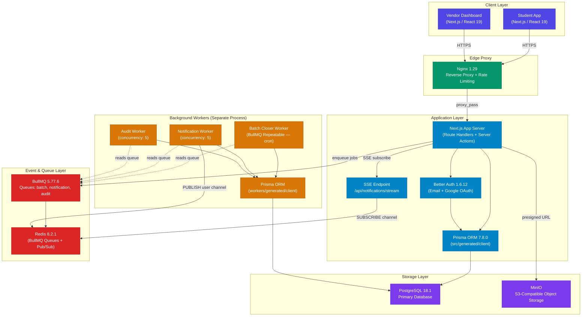
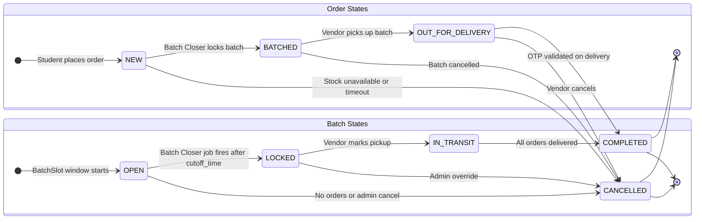
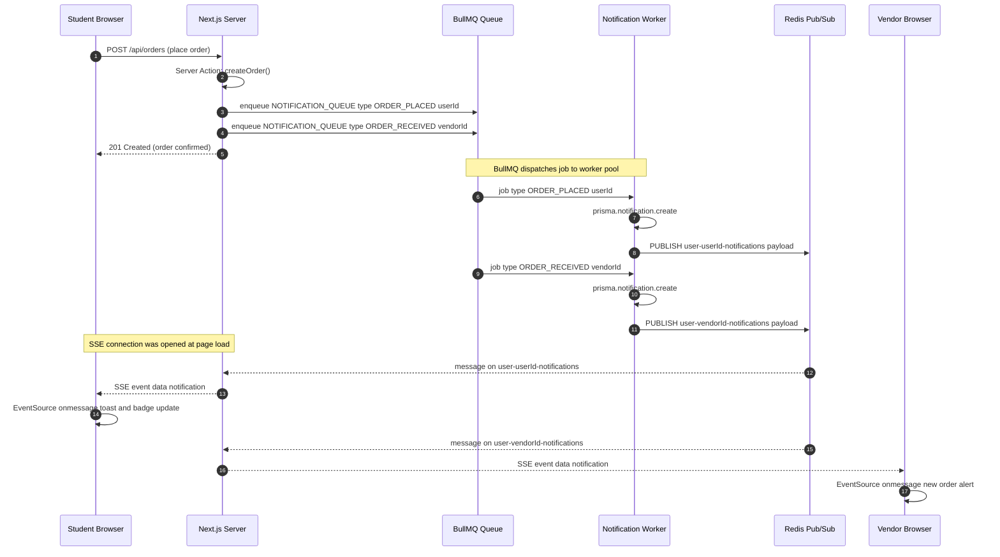
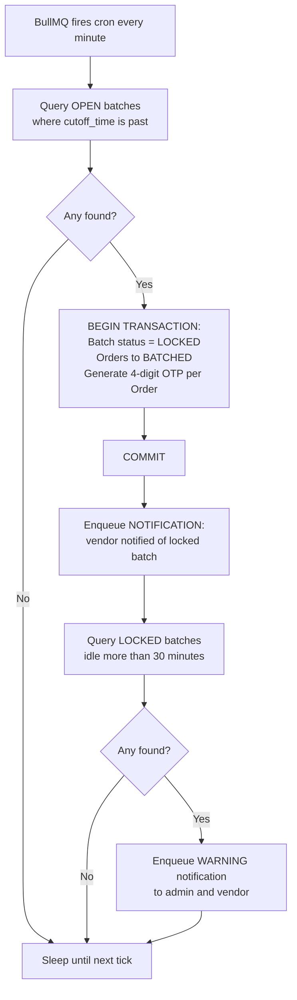
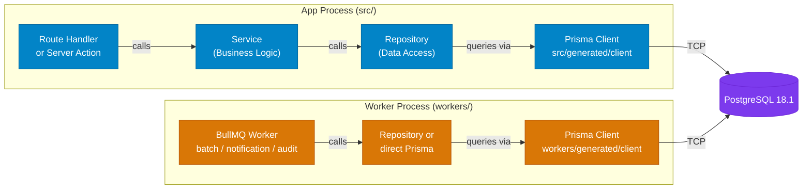
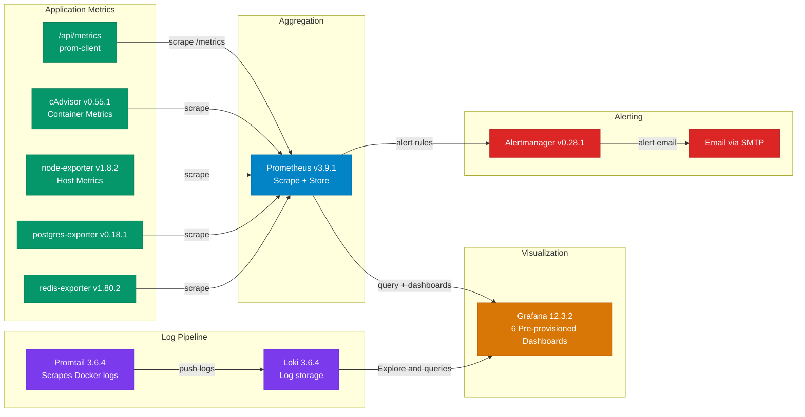

# 🏔️ Campus Connect — Architecture Deep-Dive


> **Campus Connect** is a batch-delivery marketplace purpose-built for NIT Arunachal Pradesh, where student hostels sit 100 metres above street-level vendors. The core innovation — **Batch & Climb** — groups orders into time-slot batches so vendors make a single uphill trip, reducing vendor fatigue and delivery costs dramatically.

This document is the authoritative technical reference for engineers joining the project. It covers the full system architecture, key design decisions, data models, background workers, and the observability stack.

---

## 📋 Table of Contents

1. [🏗️ System Architecture Overview](#️-system-architecture-overview)
2. [🔄 Order & Batch Lifecycle](#-order--batch-lifecycle)
3. [🛠️ Key Technical Decisions](#️-key-technical-decisions)
4. [📁 Codebase Directory Tour](#-codebase-directory-tour)
5. [🗃️ Data Model Highlights](#️-data-model-highlights)
6. [⚙️ Background Workers Deep-Dive](#️-background-workers-deep-dive)
7. [📊 Monitoring & Observability](#-monitoring--observability)

---

## 🏗️ System Architecture Overview

Campus Connect follows a **layered, containerized architecture** composed of four logical tiers: a client layer (Next.js SSR + React), an edge proxy (Nginx), an application layer (Next.js server + separate worker process), and a storage/messaging tier (PostgreSQL, Redis, MinIO). All services are orchestrated via Docker Compose with `dev` and `prod` profiles.

The application process and the background worker process are **deliberately isolated** — each runs its own Prisma client, its own Redis connection, and its own Docker container. A crash in the worker never takes down the web server.



---

## 🔄 Order & Batch Lifecycle

### State Machines

Every `Order` and every `Batch` moves through a defined set of states. The two state machines are coupled — an `Order` cannot reach `COMPLETED` without its parent `Batch` reaching `COMPLETED` first.



### Real-Time Notification Sequence

The diagram below traces a single notification from order placement all the way to the browser — no WebSocket server required. Redis Pub/Sub bridges the stateless Next.js process and the persistent worker process.



### Batch Closer — Step-by-Step Flow

Every minute, the **Batch Closer** BullMQ Repeatable Job wakes up and runs the following logic:



---

## 🛠️ Key Technical Decisions

### 1. Dual Prisma Client Generation

`schema.prisma` contains **two `generator` blocks**, producing two independent Prisma clients:

| Client        | Output Path                | Used By                                             |
| ------------- | -------------------------- | --------------------------------------------------- |
| App client    | `src/generated/client`     | Next.js app server (Route Handlers, Server Actions) |
| Worker client | `workers/generated/client` | Worker process (Batch Closer, Notification, Audit)  |

**Why:** Each process has its own connection pool. A crash, memory leak, or hung query in the worker process cannot starve the web app of DB connections. It also makes the worker independently deployable and testable.

---

### 2. Worker as a Separate Process

`workers/index.ts` is compiled with `tsconfig.worker.json` and deployed as its own Docker container (`worker-runner`). It:

- Connects to BullMQ queues (Redis)
- Registers a **BullMQ Repeatable Job** (cron `* * * * *`) for batch closing at startup
- Handles `SIGTERM` and `SIGINT` gracefully: closes all workers, disconnects Prisma, disconnects Redis

**Why:** Decoupling the background processor from the web server allows independent scaling (e.g., run multiple worker containers), independent restarts, and prevents runaway batch-closing logic from degrading the API.

---

### 3. Batch Scheduling: Slot vs. Instance Separation

Two distinct models exist:

- **`BatchSlot`** — a _template_ (e.g., `cutoff_time_minutes: 1020` = 5:00 PM daily)
- **`Batch`** — a _concrete instance_ created each day, with an actual `cutoff_time` datetime and a `status`

**Why:** If an admin changes a slot's cutoff time mid-day, historical `Batch` records retain their original cutoff. This separation preserves auditability — you can always answer "what were the exact terms of this delivery?"

---

### 4. OTP-Gated Delivery

At the moment a `Batch` transitions to `LOCKED`:

1. A 4-digit OTP is generated for **each `Order`** in the batch.
2. The OTP is stored on the `Order` row.
3. The student sees it in-app.
4. The vendor enters the OTP on delivery; it is validated server-side before the order moves to `COMPLETED`.

**Why:** Prevents fraudulent delivery completion. Without OTP verification, a vendor could mark an order delivered without actually reaching the student.

---

### 5. Real-Time via SSE + Redis Pub/Sub (No WebSocket Server)

The `/api/notifications/stream` Route Handler opens a long-lived HTTP response (Server-Sent Events) and subscribes to two Redis channels via `ioredis`:

- `user:{id}:notifications` — targeted notifications
- `broadcast:notifications` — platform-wide announcements

When the Notification Worker PUBLISHes to a channel, every connected SSE handler subscribed to that channel forwards the event to its browser client.

**Why:** SSE is unidirectional (server → client) and works over standard HTTP/2. No WebSocket infrastructure (load-balancer upgrades, sticky sessions, etc.) is needed. Redis Pub/Sub acts as the fan-out bus across multiple Next.js replicas.

---

### 6. Delivery Address Snapshot

`Order.delivery_address_snapshot` is a JSON string set **at order creation time** and never modified.

**Why:** A student's address may change (room transfer, dorm swap). Without a snapshot, historical order records would silently reflect the new address instead of where the delivery actually went. The snapshot preserves the exact delivery context at the moment of purchase.

---

### 7. Denormalized Review Aggregates

`Product` carries two extra columns: `rating_sum` (sum of all star ratings) and `review_count` (total reviews). Computing the average rating is `O(1)`:

```
average_rating = rating_sum / review_count
```

Both columns are updated **transactionally** every time a review is written or deleted.

**Why:** Avoids a full `AVG()` aggregate query over the reviews table on every product listing page load — critical for performance on popular products with thousands of reviews.

---

### 8. Async Admin Audit Log

`lib/audit/audit-producer.ts` enqueues a job to `AUDIT_QUEUE` (BullMQ). The `auditWorker` (concurrency: 5) processes the job asynchronously and writes an `AdminAuditLog` row.

**Why:** Admin actions (approvals, rejections, overrides) must be recorded, but writing to the audit table synchronously would add latency to every admin API response. The BullMQ queue absorbs the write, and the admin sees their action confirmed immediately.

---

### 9. Multi-Stage Docker Build (7 Stages)

The `Dockerfile` uses a pipeline of named stages:

```
base → deps → prod-deps → app-builder → worker-builder → runner + worker-runner
                                                        → migrator (separate target)
```

- **Non-root users** in all runtime containers
- **`read_only: true`** filesystems with explicit `tmpfs` mounts for writable scratch space
- The `migrator` target runs `prisma migrate deploy` before the app starts, ensuring schema is always current

**Why:** Multi-stage builds minimize final image size (only production artifacts copied in), and the security hardening (non-root + read-only FS) reduces the blast radius of a container escape.

---

### 10. Automated PostgreSQL Backups

Backups run automatically every **6 hours** with a tiered retention policy:

| Tier    | Count |
| ------- | ----- |
| Daily   | 7     |
| Weekly  | 4     |
| Monthly | 6     |

**Why:** The marketplace handles real financial transactions (order fees, platform fees). Data loss is unacceptable. The tiered retention balances storage cost with recovery point objectives.

---

## 📁 Codebase Directory Tour

### Full Project Tree

```
campus-connect/
├── nginx/                         # Nginx configs
│   ├── dev.conf
│   └── prod.conf
├── prisma/
│   ├── schema.prisma              # Single schema → 2 Prisma client targets
│   └── migrations/
├── monitoring/                    # Full observability config
│   ├── prometheus/
│   │   ├── prometheus.yml
│   │   └── rules.yml
│   ├── alertmanager/
│   ├── grafana/
│   │   ├── dashboards/            # 6 pre-provisioned JSON dashboards
│   │   └── provisioning/
│   ├── loki/
│   └── promtail/
├── workers/                       # Separate Node.js process
│   ├── index.ts                   # Entrypoint — registers workers + SIGTERM handler
│   ├── batch/
│   │   └── batch-closer.ts        # BullMQ Worker + Queue (repeatable cron job)
│   ├── notification/
│   │   ├── consumer.ts            # BullMQ Worker: persist + Redis PUBLISH
│   │   └── types.ts
│   ├── audit/
│   │   ├── consumer.ts            # BullMQ Worker: write AdminAuditLog rows
│   │   └── types.ts
│   ├── scripts/
│   │   └── cleanup-orphaned-files.ts
│   └── lib/                       # Worker-local infrastructure singletons
│       ├── prisma.ts              # Own Prisma singleton (workers/generated/client)
│       ├── redis.ts
│       ├── redis-connection.ts
│       └── logger.ts
└── src/
    ├── app/
    │   ├── api/                   # Next.js Route Handlers
    │   │   ├── auth/              # Better Auth + custom register endpoint
    │   │   ├── notifications/stream/  # SSE endpoint
    │   │   ├── metrics/           # prom-client Prometheus exposition
    │   │   ├── health/            # liveness + readiness probes
    │   │   ├── orders/[id]/pdf/   # React PDF receipt generation
    │   │   ├── search/
    │   │   └── upload/            # Presigned MinIO URLs
    │   ├── actions/               # Next.js Server Actions
    │   │   ├── admin/             # 12 admin action files
    │   │   └── vendor/            # batch, batch-slot, individual-delivery
    │   ├── (public)/              # Unauthenticated pages
    │   ├── (private)/             # Auth-required pages
    │   └── (protected)/           # Admin-only pages
    ├── components/                # ~200 components
    │   ├── ui/                    # shadcn/ui primitives (35 components)
    │   ├── shared/                # Cross-feature components
    │   ├── owned-shop/            # Vendor dashboard components
    │   └── admin/                 # Admin data tables, dialogs
    ├── hooks/
    │   ├── queries/               # TanStack Query v5 hooks
    │   ├── ui/                    # Form/filter/drawer state hooks
    │   └── utils/                 # useInfiniteScroll, useLiveNotifications, useOnlineStatus
    ├── repositories/              # Data access layer — 13 repository files
    ├── services/                  # Business logic — 19 service domains
    ├── di/
    │   └── container.ts           # Dependency injection container
    ├── lib/
    │   ├── auth.ts                # Better Auth configuration
    │   ├── prisma.ts              # Prisma singleton (app process)
    │   ├── redis.ts               # ioredis client (app process)
    │   ├── notification-emitter.ts  # Enqueues to BullMQ notification queue
    │   └── audit/
    │       └── audit-producer.ts  # Enqueues to BullMQ audit queue
    ├── validations/               # Zod 4 schemas
    ├── types/
    └── rbac.ts                    # Role-based access control definitions
```

### Layer Architecture

The strict layering rule is: **API routes / Server Actions → Services → Repositories → Prisma**. No layer may be skipped.



### Layer Reference Table

| Layer                         | Role                                                | Example Files                                                                  |
| ----------------------------- | --------------------------------------------------- | ------------------------------------------------------------------------------ |
| Route Handler / Server Action | HTTP entry point, input validation, auth check      | `src/app/api/orders/route.ts`, `src/app/actions/vendor/batch.ts`               |
| Service                       | Business logic, orchestration, cross-cutting rules  | `src/services/order.service.ts`, `src/services/batch.service.ts`               |
| Repository                    | Prisma queries, data access only, no business logic | `src/repositories/order.repository.ts`, `src/repositories/batch.repository.ts` |
| Prisma Client (app)           | ORM, connection pool for web server                 | `src/generated/client`                                                         |
| Prisma Client (worker)        | ORM, isolated connection pool for workers           | `workers/generated/client`                                                     |
| PostgreSQL                    | Source of truth for all persistent data             | —                                                                              |

---

## 🗃️ Data Model Highlights

### Order State Machine

```
NEW → BATCHED → OUT_FOR_DELIVERY → COMPLETED
 ↘                ↘                ↘
  CANCELLED       CANCELLED        CANCELLED
```

| State              | Meaning                                          |
| ------------------ | ------------------------------------------------ |
| `NEW`              | Order placed by student; waiting to be batched   |
| `BATCHED`          | Batch has been locked; OTP generated             |
| `OUT_FOR_DELIVERY` | Vendor has picked up the batch                   |
| `COMPLETED`        | OTP validated; delivery confirmed                |
| `CANCELLED`        | Cancelled for any reason (stock, timeout, admin) |

### Batch State Machine

```
OPEN → LOCKED → IN_TRANSIT → COMPLETED
  ↘      ↘
CANCELLED CANCELLED
```

| State        | Trigger                                         |
| ------------ | ----------------------------------------------- |
| `OPEN`       | Created when first order lands in a slot window |
| `LOCKED`     | Batch Closer job fires after `cutoff_time`      |
| `IN_TRANSIT` | Vendor marks pickup in-app                      |
| `COMPLETED`  | All member orders reach `COMPLETED`             |
| `CANCELLED`  | Admin override or zero-order edge case          |

### Seller Verification States

```
NOT_STARTED → PENDING → REQUIRES_ACTION → VERIFIED
                     ↘                  ↘
                    REJECTED            REJECTED
```

A vendor submits documents (`PENDING`). An admin may request corrections (`REQUIRES_ACTION`) before ultimately approving (`VERIFIED`) or rejecting (`REJECTED`).

### Key Design Choices

| Feature                     | Model                                               | Design                                                                                                      |
| --------------------------- | --------------------------------------------------- | ----------------------------------------------------------------------------------------------------------- |
| Delivery address            | `Order.delivery_address_snapshot`                   | JSON string snapshot taken at order creation; immutable thereafter                                          |
| Platform fee                | `PlatformSettings` singleton + `Order.platform_fee` | Fee locked into each order at checkout; changing the global fee never retroactively affects existing orders |
| Product soft delete         | `Product.deleted_at`                                | Products are never hard-deleted; historical orders retain full product references                           |
| Shop soft delete            | `Shop.deleted_at`                                   | Same pattern — shop records survive even after de-listing                                                   |
| Review aggregates           | `Product.rating_sum`, `Product.review_count`        | Denormalized for O(1) average calculation; updated transactionally per review                               |
| Stock watch                 | `StockWatch` join model                             | Users subscribe to out-of-stock products and receive a notification when stock is replenished               |
| Batch template vs. instance | `BatchSlot` (config) + `Batch` (runtime)            | Slot config changes never rewrite historical batch records                                                  |

---

## ⚙️ Background Workers Deep-Dive

All workers live in the `workers/` directory and are started by `workers/index.ts`, which:

1. Instantiates each BullMQ `Worker`
2. Registers the Batch Closer Repeatable Job
3. Registers `SIGTERM` / `SIGINT` handlers for graceful shutdown

### Batch Closer Worker

**File:** `workers/batch/batch-closer.ts`  
**Type:** BullMQ Worker + BullMQ Repeatable Job  
**Schedule:** cron `* * * * *` (every 60 seconds)

#### Pseudocode

```
every minute:
  openBatches = SELECT * FROM Batch
                WHERE status = 'OPEN'
                  AND cutoff_time <= NOW()

  for each batch in openBatches:
    BEGIN TRANSACTION
      UPDATE Batch SET status = 'LOCKED' WHERE id = batch.id
      UPDATE Order SET status = 'BATCHED'
        WHERE batch_id = batch.id AND status = 'NEW'
      for each order in batch.orders:
        otp = generateFourDigitOTP()
        UPDATE Order SET otp = otp WHERE id = order.id
    COMMIT

    enqueue(NOTIFICATION_QUEUE, {
      type: 'BATCH_LOCKED',
      vendorId: batch.vendorId,
      batchId: batch.id
    })

  staleBatches = SELECT * FROM Batch
                 WHERE status = 'LOCKED'
                   AND locked_at <= NOW() - 30 MINUTES

  for each batch in staleBatches:
    enqueue(NOTIFICATION_QUEUE, {
      type: 'BATCH_STALE_WARNING',
      adminId: SYSTEM,
      vendorId: batch.vendorId
    })
```

The atomic transaction ensures that a batch is never seen in a half-locked state — either all orders are `BATCHED` and all OTPs generated, or none are.

---

### Notification Worker

**File:** `workers/notification/consumer.ts`  
**Concurrency:** 5  
**Queue:** `NOTIFICATION_QUEUE`

Handles two job types:

| Job Type                 | Action                                                                                                          |
| ------------------------ | --------------------------------------------------------------------------------------------------------------- |
| `SEND_NOTIFICATION`      | Writes a `Notification` row for a specific `userId`, then `PUBLISH`es to `user:{userId}:notifications` on Redis |
| `BROADCAST_NOTIFICATION` | Writes a `Notification` row with no specific user, then `PUBLISH`es to `broadcast:notifications` on Redis       |

The SSE endpoint at `/api/notifications/stream` has already subscribed to these channels, so the browser receives the event within milliseconds of the `PUBLISH`.

---

### Audit Worker

**File:** `workers/audit/consumer.ts`  
**Concurrency:** 5  
**Queue:** `AUDIT_QUEUE`

Receives `AuditJobData` payloads (actor, action, target entity, metadata) and writes `AdminAuditLog` rows. Because this is processed asynchronously:

- Admin API responses are never blocked by audit writes
- The audit trail is eventually consistent (typically within seconds)
- Failures in audit logging do not cause admin actions to roll back

---

### Graceful Shutdown

`workers/index.ts` registers handlers for `SIGTERM` and `SIGINT`:

```typescript
process.on("SIGTERM", async () => {
  await batchCloserWorker.close();
  await notificationWorker.close();
  await auditWorker.close();
  await prisma.$disconnect();
  redis.disconnect();
  process.exit(0);
});
```

BullMQ's `worker.close()` waits for the currently-executing job to finish before closing the worker. This prevents orphaned jobs or corrupted state during rolling restarts.

---

## 📊 Monitoring & Observability

The full observability stack is only active in the **`prod`** Docker Compose profile. It provides metrics, logs, alerting, and dashboards with zero code changes required to the application.

### Observability Pipeline



### Observability Component Reference

| Component         | Image                                           | Purpose                                                |
| ----------------- | ----------------------------------------------- | ------------------------------------------------------ |
| Prometheus        | `prom/prometheus:v3.9.1`                        | Time-series metrics storage + alerting engine          |
| Grafana           | `grafana/grafana:12.3.2`                        | Dashboard visualization + log exploration              |
| Loki              | `grafana/loki:3.6.4`                            | Log aggregation and querying                           |
| Promtail          | `grafana/promtail:3.6.4`                        | Scrapes Docker container logs → pushes to Loki         |
| Alertmanager      | `prom/alertmanager:v0.28.1`                     | Routes Prometheus alerts → email via SMTP              |
| cAdvisor          | `gcr.io/cadvisor/cadvisor:v0.55.1`              | Per-container CPU/memory/network metrics               |
| node-exporter     | `prom/node-exporter:v1.8.2`                     | Host-level OS metrics (CPU, disk, memory, network)     |
| postgres-exporter | `prometheuscommunity/postgres-exporter:v0.18.1` | PostgreSQL query stats, connection counts, table sizes |
| redis-exporter    | `oliver006/redis_exporter:v1.80.2`              | Redis memory, hit rate, command throughput             |

### Pre-Provisioned Grafana Dashboards

| Dashboard ID              | Focus                                                  |
| ------------------------- | ------------------------------------------------------ |
| `campus-connect-overview` | Business metrics: orders/hour, active batches, revenue |
| `app-nextjs`              | Request rates, p95 response times, error rates         |
| `docker-containers`       | Per-container CPU, memory, network via cAdvisor        |
| `node-overview`           | Host CPU, memory, disk I/O, network throughput         |
| `postgres`                | Query performance, connection pool usage, table sizes  |
| `redis`                   | Memory usage, keyspace hit rate, command throughput    |

> **Important:** `monitoring/alertmanager/alertmanager.yml` uses `envsubst` at container startup to inject SMTP credentials from environment variables. No secrets are committed to the repository. See `.env.example` for required variables.

> **Tip:** To access Grafana locally in `prod` mode, visit `http://localhost:3001`. Default credentials are configured via environment variables. Prometheus UI is at `http://localhost:9090`.

---

_Last updated: June 2026 · Maintained by the Campus Connect core team_
