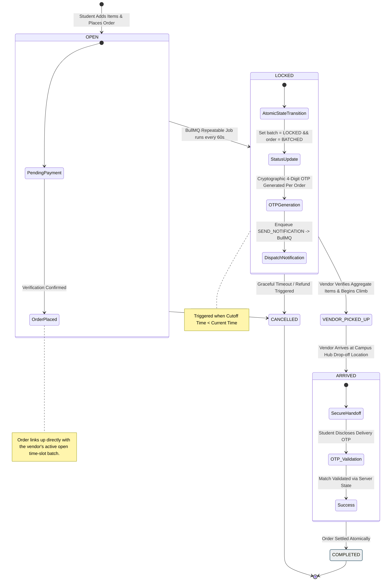
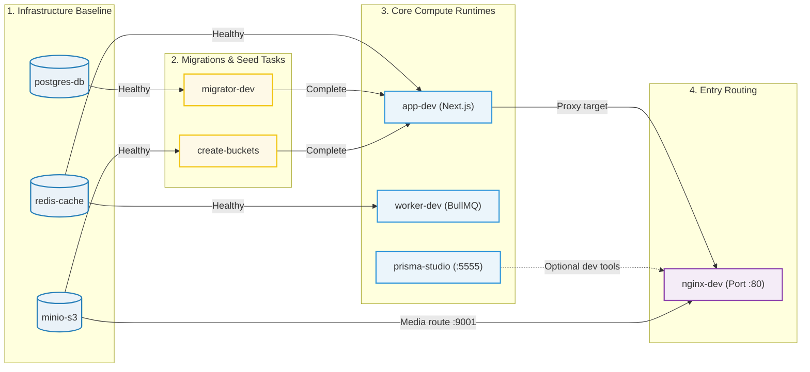

# Campus Connect

> A production-grade, batch-delivery marketplace built for a campus with a 100-metre altitude problem.

<div align="center">

[](https://connect.nitap.ac.in)
[](https://deepwiki.com/coding-pundit-nitap/campus-connect)
[](https://nextjs.org)
[](https://www.typescriptlang.org)
[](https://www.prisma.io)
[](https://docs.docker.com/compose)
[](https://better-auth.com)
[](https://bullmq.io)

</div>

---

## Table of Contents

- [🏔️ The Problem Worth Solving](#️-the-problem-worth-solving)
- [🚀 The Solution: Batch & Climb](#-the-solution-batch--climb)
- [🛠️ Tech Stack](#️-tech-stack)
- [📋 Prerequisites](#-prerequisites)
- [🚀 Installation & Setup](#-installation--setup)
- [⚙️ Environment Variables](#️-environment-variables)
- [🐳 Docker Usage](#-docker-usage)
- [📜 Available Scripts](#-available-scripts)
- [🤝 Contributing](#-contributing)
- [📄 License](#-license)

---

## 🏔️ The Problem Worth Solving

**NIT Arunachal Pradesh sits on a hillside.** The student hostels are approximately **100 metres above** the street-level vendors. That's not a metaphor — it's a literal altitude gap that makes food and supply delivery painful for everyone involved.

Before Campus Connect, the workflow looked like this:

- Students placed orders over fragmented **WhatsApp messages** with no confirmation
- Vendors had **no consolidated view** of what was needed
- **10 student orders = 10 separate uphill climbs** for a single vendor
- There were **no delivery guarantees**, no OTP confirmation, no paper trail

Every order was an uncoordinated, exhausting, inefficient climb.

---

## 🚀 The Solution: Batch & Climb

Campus Connect's core innovation is the **Batch & Climb** model — a time-slot batching system that turns chaos into a single, coordinated trip.

### How it works

1. **Students order** from a vendor before a time-slot cutoff
2. **Orders group** automatically into an open batch for that time slot
3. **Cutoff hits** → a BullMQ Repeatable Job locks the batch and generates a cryptographic 4-digit OTP per order
4. **Vendor reviews** the aggregate order list, packs items, and makes **one single trip uphill**
5. **Student discloses OTP** → server validates → delivery confirmed atomically



**The result: 1 trip, N orders, zero chaos.**

---

## 🛠️ Tech Stack

### Application

| Layer           | Technology                          | Version    |
| --------------- | ----------------------------------- | ---------- |
| Framework       | Next.js (App Router)                | 16.2.6     |
| Language        | TypeScript                          | 6.0.3      |
| UI Components   | React + Tailwind CSS v4 + shadcn/ui | 19.2.6 / 4 |
| ORM             | Prisma                              | 7.8.0      |
| Auth            | Better Auth (Email + Google OAuth)  | 1.6.12     |
| Forms           | React Hook Form + Zod               | 7 / 4.4.3  |
| Server State    | TanStack Query                      | 5          |
| Background Jobs | BullMQ                              | 5.77.6     |
| Logging         | Pino                                | 10         |
| PDF Generation  | @react-pdf/renderer                 | 4          |

### Infrastructure

| Service    | Image                            | Purpose                      |
| ---------- | -------------------------------- | ---------------------------- |
| PostgreSQL | `postgres:18.1-alpine`           | Primary database             |
| Redis      | `redis:8.2.1-alpine`             | Job queues, Pub/Sub          |
| MinIO      | `minio/minio:RELEASE.2025-09-07` | S3-compatible object storage |
| Nginx      | `nginx:1.29-alpine`              | Reverse proxy, rate limiting |

> For the full architecture deep-dive including system diagrams, technical decisions, data model, and monitoring stack, see [ARCHITECTURE.md](./ARCHITECTURE.md).

---

## 📋 Prerequisites

| Requirement    | Version | Install                                                                                 |
| -------------- | ------- | --------------------------------------------------------------------------------------- |
| Node.js        | v20+    | [nodejs.org](https://nodejs.org)                                                        |
| pnpm           | latest  | `npm install -g corepack && corepack enable && corepack prepare pnpm@latest --activate` |
| Docker         | v24+    | [docs.docker.com](https://docs.docker.com/get-docker)                                   |
| Docker Compose | v2.20+  | Bundled with Docker Desktop                                                             |

---

## 🚀 Installation & Setup

### 1. Clone

```bash
git clone https://github.com/coding-pundit-nitap/campus-connect.git
cd campus-connect
```

### 2. Environment files

```bash
cp .env.example .env
# Edit .env with your local credentials
```

### 3. Start the development stack

```bash
pnpm docker:dev:up
```

This single command orchestrates the **entire development environment** in the correct dependency order — no manual wiring required:



### 4. Seed test data

```bash
docker compose exec app-dev pnpm exec tsx prisma/seed-test.ts
```

This populates your local database with a complete development fixture set: a sample shop, vendor account, student account, product catalogue, time-slot batch configurations, and orders spanning all lifecycle states — giving you a fully functional environment without any manual data entry.

### 5. Access services

| Service       | URL                   |
| ------------- | --------------------- |
| Application   | http://localhost      |
| MinIO Console | http://localhost:9001 |
| Prisma Studio | http://localhost:5555 |

---

## ⚙️ Environment Variables

Copy `.env.example` to `.env` and populate the values. The full set of variables:

```env
AWS_ACCESS_KEY_ID=minioadmin
AWS_SECRET_ACCESS_KEY=minioadmin
AWS_REGION=us-east-1
MINIO_ROOT_USER=minioadmin
MINIO_ROOT_PASSWORD=minioadmin
MINIO_REGION=us-east-1
NEXT_PUBLIC_MINIO_BUCKET=campus-connect
MINIO_ENDPOINT=http://minio:9000
NEXT_PUBLIC_MINIO_ENDPOINT=http://localhost:9000

POSTGRES_USER=connect
POSTGRES_PASSWORD=mypassword
POSTGRES_DB=campus_connect

DATABASE_URL=postgresql://connect:mypassword@db:5432/campus_connect?schema=public&connection_limit=10&pgbouncer=true
DIRECT_URL=postgresql://connect:mypassword@db:5432/campus_connect

REDIS_URL=redis://redis:6379

SMTP_HOST=smtp.gmail.com
SMTP_PORT=587
SMTP_USER=your-email@gmail.com
SMTP_PASS=your-app-password
ALERT_EMAIL_FROM=alerts@yourdomain.com
ALERT_EMAIL_TO=admin@yourdomain.com
NOTIFICATION_EMAIL_FROM=notifications@example.com

GRAFANA_ADMIN_USER=admin
GRAFANA_ADMIN_PASSWORD=changeme
```

---

## 🐳 Docker Usage

### Development

| Command                             | Description                                 |
| ----------------------------------- | ------------------------------------------- |
| `pnpm docker:dev:up`                | Start full dev stack                        |
| `pnpm docker:dev:build`             | Rebuild images after `package.json` changes |
| `pnpm docker:dev:logs`              | Stream all container logs                   |
| `pnpm docker:dev:logs-app`          | Tail the app container only                 |
| `docker compose logs -f worker-dev` | Tail the worker container only              |
| `pnpm docker:dev:down`              | Stop and remove all containers              |

### Production

| Command                               | Description                |
| ------------------------------------- | -------------------------- |
| `pnpm docker:prod:build`              | Build production images    |
| `docker compose --profile prod up -d` | Start the production stack |
| `pnpm docker:prod:logs`               | Stream all production logs |
| `pnpm docker:prod:logs-worker`        | Tail the production worker |

---

## 📜 Available Scripts

### Application

| Script              | Description                                        |
| ------------------- | -------------------------------------------------- |
| `pnpm dev`          | Next.js dev server (outside Docker)                |
| `pnpm build`        | Production Next.js build                           |
| `pnpm build:worker` | Compile worker TypeScript → `dist/workers`         |
| `pnpm validate`     | typecheck + lint:fix + format (required before PR) |
| `pnpm typecheck`    | `tsc --noEmit`                                     |
| `pnpm lint:fix`     | ESLint auto-fix                                    |
| `pnpm format`       | Prettier write                                     |

### Database

| Script                   | Description                                |
| ------------------------ | ------------------------------------------ |
| `pnpm db:migrate`        | Create + apply migration (local dev)       |
| `pnpm db:deploy`         | Apply existing migrations (CI/prod)        |
| `pnpm db:studio`         | Open Prisma Studio locally                 |
| `pnpm docker:db:migrate` | `migrate dev` inside running dev container |
| `pnpm docker:db:psql`    | Interactive psql shell                     |

### Redis Diagnostics

| Script                       | Description             |
| ---------------------------- | ----------------------- |
| `pnpm redis:cli`             | Interactive Redis CLI   |
| `pnpm redis:memory`          | Memory breakdown        |
| `pnpm redis:keyspace`        | Key distribution        |
| `pnpm redis:pubsub:channels` | Active Pub/Sub channels |
| `pnpm redis:bigkeys`         | Find large keys         |
| `pnpm redis:flushall`        | ⚠️ Flush all data       |

### Maintenance

| Script                            | Description                              |
| --------------------------------- | ---------------------------------------- |
| `pnpm cleanup:orphaned-files:dry` | Preview MinIO files with no DB reference |
| `pnpm cleanup:orphaned-files`     | Delete orphaned MinIO files              |

---

## 🤝 Contributing

We'd love your help making Campus Connect better. Here's everything you need to know before opening a PR.

### Pre-commit hooks

**Husky + lint-staged** run automatically on every commit. Prettier and ESLint will auto-fix staged files before your commit lands — no manual formatting step needed.

### Branching convention

```
yourname/short-description
```

**Example:** `aryan/stock-restock-notifications`

### Layering rules

> [!IMPORTANT]
> **Never skip a layer.** The codebase enforces a strict separation of concerns:
>
> ```
> API Routes / Server Actions  →  Services  →  Repositories  →  Prisma
> ```
>
> - **API Routes / Server Actions** handle HTTP/RPC concerns only — no business logic
> - **Services** contain all business logic and orchestration
> - **Repositories** are the only layer that touches Prisma directly
> - **Prisma** is the ORM — never called from routes or services directly

Skipping layers (e.g., calling Prisma from a route) will be flagged in code review.

### New database changes

```bash
pnpm docker:db:migrate
```

Run this inside the running dev container whenever you modify the Prisma schema.

### Before every PR

```bash
pnpm validate
```

This runs `typecheck + lint:fix + format` in sequence. **PRs that fail validation will not be merged.**

### PR size limit

Keep PRs **under 300 lines changed**. Large PRs are hard to review and slow down the team. Break big features into logical, reviewable chunks.

### Commit style — Conventional Commits

```
feat: add OTP resend endpoint for locked batches
fix: prevent double-lock race condition in batch closer
docs: update seed script instructions in README
refactor: extract payment verification into service layer
chore: upgrade Prisma to 7.8.0
```

See [CONTRIBUTING.md](./CONTRIBUTING.md) for the full contribution workflow.

---

## 📄 License

Maintained by Coding Club @ NIT Arunachal Pradesh (Coding Pundit). See [LICENSE](./LICENSE) for details.

---

<p align="center">
  Built with ❤️ at NIT Arunachal Pradesh ·
  <a href="https://connect.nitap.ac.in">connect.nitap.ac.in</a>
</p>
